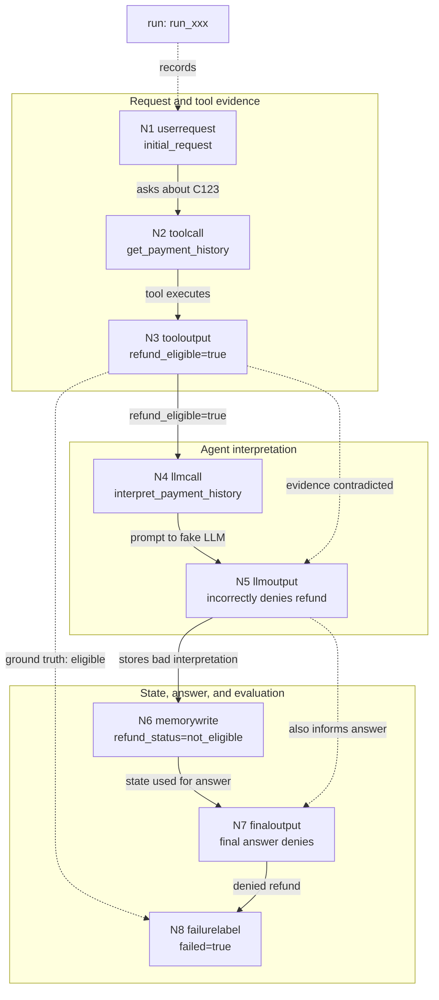

# Frameworkless Refund Agent Demo

This demo records a tiny, deterministic customer-support refund workflow with
BranchPoint. It does not use LangGraph, LangChain, CrewAI, PydanticAI, or any
other agent framework.

The fake workflow intentionally fails:

1. A user asks whether customer `C123` is eligible for a refund.
2. A tool output says `refund_eligible=true`.
3. A fake LLM incorrectly says the customer is not eligible.
4. Memory stores `refund_status=not_eligible`.
5. The final answer denies the refund.
6. A failure label marks the run as failed because the customer was eligible.

## Run It

From the repository root:

```bash
uv run python examples/refund_agent/run_demo.py
```

The script creates a BranchPoint project named `refund-agent-demo`, starts a
trace named `refund-workflow`, emits the full fake workflow, builds the graph,
prints the run ID, events, event payloads, and graph edges, then writes and
opens a Mermaid graph viewer under `.branchpoint/graphs/`. It also writes the
raw `.mmd` Mermaid source next to the viewer.

For non-interactive environments, skip opening the Mermaid viewer:

```bash
uv run python examples/refund_agent/run_demo.py --no-open
```

Inspect the stored trace with the CLI:

```bash
uv run python -m branchpoint runs
uv run python -m branchpoint events <run_id>
uv run python -m branchpoint graph <run_id>
```

## Expected Output

The exact IDs will vary, but the event list should include:

```text
userrequest initial_request
toolcall get_payment_history
tooloutput get_payment_history
llmcall interpret_payment_history
llmoutput interpret_payment_history
memorywrite write_refund_status
finaloutput final_answer
failurelabel evaluator_result
```

The graph should include dependency edges created from explicit `input_refs`,
including:

```text
tooloutput -> llmcall
llmoutput -> memorywrite
finaloutput -> failurelabel
```

## Graph View



## What This Proves

This proves the BranchPoint Phase 1 path for a framework-agnostic workflow:

```text
instrumentation -> recording -> storage -> graph building
```

The demo records a simple agent-like execution, stores the trace in the local
BranchPoint SQLite store, builds a dependency graph, and prints the run, events,
and graph edges.

## What This Does Not Prove Yet

This demo does not implement scoring, candidate ranking, replay, dashboard,
machine learning, LangGraph support, framework adapters, real API calls, or a
real LLM. It is only a deterministic trace-recording example.
